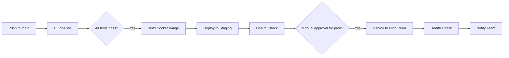

# Deployment Guide

This project uses GitHub Actions for Continuous Integration (CI) and Continuous Deployment (CD).

## Overview

- **CI Pipeline** (`ci.yml`): Runs on every push and PR to `main` and `develop` branches
- **CD Pipeline** (`cd.yml`): Deploys to staging automatically on `main` branch, production manually

## Deployment Flow



## Required Secrets

Configure these secrets in your GitHub repository settings:

### Staging Environment
- `STAGING_HOST`: Server hostname or IP
- `STAGING_USER`: SSH username
- `STAGING_SSH_KEY`: Private SSH key for server access
- `STAGING_PORT`: SSH port (optional, defaults to 22)
- `STAGING_PATH`: Deployment path (optional, defaults to `/var/www/4seasons`)
- `STAGING_URL`: Application URL for health checks (optional)

### Production Environment
- `PRODUCTION_HOST`: Server hostname or IP
- `PRODUCTION_USER`: SSH username
- `PRODUCTION_SSH_KEY`: Private SSH key for server access
- `PRODUCTION_PORT`: SSH port (optional, defaults to 22)
- `PRODUCTION_PATH`: Deployment path (optional, defaults to `/var/www/4seasons`)
- `PRODUCTION_URL`: Application URL for health checks (optional)

### Notifications (Optional)
- `SLACK_WEBHOOK_URL`: Slack webhook for deployment notifications

## Deployment Types

### Automatic Staging Deployment
- Triggers automatically when code is pushed to `main` branch
- Runs after all CI tests pass
- Deploys latest Docker image to staging environment

### Manual Production Deployment
- Triggered manually via GitHub Actions UI
- Requires staging deployment to be successful
- Uses zero-downtime deployment strategy
- Creates automatic backups before deployment

## Manual Deployment

To deploy to production:

1. Go to **Actions** tab in GitHub
2. Select **CD Pipeline** workflow
3. Click **Run workflow**
4. Select `production` environment
5. Click **Run workflow**

## Server Setup Requirements

Your deployment servers should have:

1. **Docker & Docker Compose** installed
2. **Git** configured with access to the repository
3. **SSH access** configured for the deployment user
4. **Directory structure**:
   ```
   /var/www/4seasons/
   ├── docker-compose.prod.yml
   ├── nginx/
   ├── backend-laravel/
   │   └── .env.prod
   └── .git/
   ```

## Environment Files

### Staging: `backend-laravel/.env.staging`
```env
APP_NAME="4Seasons Staging"
APP_ENV=staging
APP_DEBUG=false
APP_URL=https://staging.4seasons.com

DB_CONNECTION=mysql
DB_HOST=your-staging-db-host
DB_PORT=3306
DB_DATABASE=4seasons_staging
DB_USERNAME=your-db-user
DB_PASSWORD=your-db-password

# Add other environment-specific variables
```

### Production: `backend-laravel/.env.prod`
```env
APP_NAME="4Seasons"
APP_ENV=production
APP_DEBUG=false
APP_URL=https://4seasons.com

DB_CONNECTION=mysql
DB_HOST=your-production-db-host
DB_PORT=3306
DB_DATABASE=4seasons
DB_USERNAME=your-db-user
DB_PASSWORD=your-db-password

# Add other environment-specific variables
```

## Rollback Procedure

If a deployment fails or issues are detected:

### Staging Rollback
```bash
cd /var/www/4seasons
git reset --hard HEAD~1
docker compose -f docker-compose.prod.yml up -d --force-recreate
```

### Production Rollback
```bash
cd /var/www/4seasons

# Find the backup directory
ls -la /var/backups/4seasons/

# Restore from backup (replace with actual backup timestamp)
BACKUP_DIR="/var/backups/4seasons/20240429_143000"
cp -r $BACKUP_DIR/* .

# Restart services
docker compose -f docker-compose.prod.yml up -d --force-recreate
```

## Monitoring & Health Checks

The deployment includes automatic health checks:

- **Endpoint**: `/api/health`
- **Timeout**: 30 seconds per attempt
- **Retries**: 10 attempts with 30-second intervals
- **Success criteria**: HTTP 200 response

## Troubleshooting

### Common Issues

1. **SSH Connection Failed**
   - Verify SSH key is correctly added to secrets
   - Check server firewall settings
   - Ensure deployment user has proper permissions

2. **Docker Image Pull Failed**
   - Check GitHub Container Registry permissions
   - Verify image tag exists
   - Check server internet connectivity

3. **Database Migration Failed**
   - Check database connectivity
   - Verify database user permissions
   - Review migration files for syntax errors

4. **Health Check Failed**
   - Check application logs: `docker compose logs backend`
   - Verify environment variables
   - Check database connection
   - Ensure all required services are running

### Debugging Commands

```bash
# Check service status
docker compose -f docker-compose.prod.yml ps

# View logs
docker compose -f docker-compose.prod.yml logs backend
docker compose -f docker-compose.prod.yml logs nginx

# Execute commands in container
docker compose -f docker-compose.prod.yml exec backend php artisan --version
docker compose -f docker-compose.prod.yml exec backend php artisan migrate:status

# Check health endpoint
curl -f http://localhost:8082/api/health
```

## Security Considerations

1. **SSH Keys**: Use dedicated deployment keys with minimal permissions
2. **Environment Variables**: Store sensitive data in GitHub Secrets
3. **Database Access**: Use read-only replicas for staging when possible
4. **Container Security**: Regularly update base images and scan for vulnerabilities
5. **Backup Encryption**: Ensure backups are encrypted at rest

## Performance Optimization

1. **Docker Layer Caching**: Enabled in build process
2. **Multi-stage Builds**: Consider implementing for smaller images
3. **CDN Integration**: Configure for static assets
4. **Database Optimization**: Regular maintenance and indexing
5. **Monitoring**: Implement APM tools for performance tracking