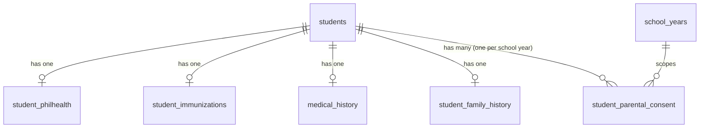

# Design Document: Student Health Data Form (SHDF)

## Overview

The Student Health Data Form (SHDF) is a digital health intake form that extends the existing school health management system. It collects PhilHealth data, immunization records, extended medical history, family history, and parental consent — including signature uploads — for each student per school year.

The system is a Laravel 11 REST API with Sanctum authentication and role-based middleware. The frontend submits a multipart form (for the signature file) or a JSON payload to a set of dedicated SHDF endpoints. The backend validates, persists, and returns the SHDF record.

The design deliberately avoids duplicating any data already stored in `students`, `medical_history`, or `allergies`. New data lives in new tables or as additive columns on existing tables.

---

## Architecture

```mermaid
flowchart TD
    Client -->|multipart/form-data or JSON| SHDFController
    SHDFController --> SHDFRequest[FormRequest Validator]
    SHDFRequest -->|passes| SHDFService
    SHDFService --> DB[(Database)]
    SHDFService --> FileStore[Storage::disk\('signatures'\)]
    SHDFController -->|403| PolicyGuard[SHDFPolicy]
    PolicyGuard --> RoleCheck{Role?}
    RoleCheck -->|clinic_staff| AllStudents
    RoleCheck -->|adviser| OwnSection
    RoleCheck -->|student| OwnRecord
```

Key layers:

- `SHDFController` — thin HTTP layer, delegates to service
- `SHDFFormRequest` — all validation rules (field presence, enum values, cross-field rules, file constraints)
- `SHDFService` — orchestrates DB writes inside a transaction and calls `FileStore`
- `SHDFPolicy` — Laravel policy enforcing role-based read/write access
- `Storage::disk('signatures')` — local or S3 disk for signature files

---

## Components and Interfaces

### Controller: `App\Http\Controllers\SHDFController`

| Method | Route | Description |
|--------|-------|-------------|
| `show` | `GET /api/shdf/{student_id}` | Retrieve SHDF for a student (current school year) |
| `store` | `POST /api/shdf` | Create or update SHDF submission |
| `showByYear` | `GET /api/shdf/{student_id}/{school_year_id}` | Retrieve SHDF for a specific school year |

All routes are protected by `auth:sanctum` middleware. Role checks are enforced via `SHDFPolicy`.

### FormRequest: `App\Http\Requests\SHDFFormRequest`

Handles all validation. Key rule groups:

- Student identity fields (required, linked to existing student record)
- PhilHealth fields (optional, 12-char alphanumeric when provided)
- Immunization statuses (required enum: yes/no/na per vaccine)
- Medical history fields (enum, boolean, cross-field exclusivity)
- Family history fields (boolean, cross-field exclusivity)
- Parental consent fields (boolean, conditional by gender/grade, file rules)

### Service: `App\Services\SHDFService`

```php
public function upsert(array $validated, UploadedFile|null $signature): SHDFResult
```

Wraps all DB writes in `DB::transaction()`. On success returns the composite SHDF record. On failure rolls back and re-throws.

### Policy: `App\Policies\SHDFPolicy`

```php
public function view(User $user, Student $student): bool
public function submit(User $user, Student $student): bool
```

- `clinic_staff` → always true
- `adviser` → true if `$student->current_adviser_id` matches adviser's `user_id`
- `student` → true if `$student->user_id` matches `$user->user_id`

---

## Data Models

### Existing tables — additive changes only

#### `students` table — new column

```
parent_guardian_name  VARCHAR(150) NULL
```

Migration: `add_parent_guardian_name_to_students_table`

#### `medical_history` table — new columns

The existing table already has: `condition_asthma`, `condition_diabetes`, `condition_heart_problem`, `condition_hypertension`, `condition_seizure_disorder`, `condition_bleeding_disorder`.

New columns to add:

```
menarche_age              VARCHAR(20)  NULL   -- '9','10',...,'14','not_applicable','other'
menarche_age_other        VARCHAR(100) NULL
allergy_status            ENUM('yes','nka') NULL
condition_error_of_refraction  BOOLEAN DEFAULT FALSE
condition_anemia               BOOLEAN DEFAULT FALSE
condition_gastric_ulcer        BOOLEAN DEFAULT FALSE
condition_anxiety_depression   BOOLEAN DEFAULT FALSE
condition_g6pd                 BOOLEAN DEFAULT FALSE
condition_none                 BOOLEAN DEFAULT FALSE
condition_other_text           TEXT NULL
medications_paracetamol        BOOLEAN DEFAULT FALSE
medications_mefenamic          BOOLEAN DEFAULT FALSE
medications_anti_allergy       BOOLEAN DEFAULT FALSE
medications_anti_asthma        BOOLEAN DEFAULT FALSE
medications_loperamide         BOOLEAN DEFAULT FALSE
medications_antacids           BOOLEAN DEFAULT FALSE
medications_or_solution        BOOLEAN DEFAULT FALSE
medications_none               BOOLEAN DEFAULT FALSE
medications_other_text         TEXT NULL
pwd_status                ENUM('acquired','congenital','none') NULL
pwd_congenital_detail     TEXT NULL
surgery_history           BOOLEAN DEFAULT FALSE
```

Migration: `add_shdf_fields_to_medical_history_table`

### New tables

#### `student_philhealth`

```
id                      BIGINT UNSIGNED AUTO_INCREMENT PRIMARY KEY
student_id              INT UNSIGNED NOT NULL UNIQUE FK→students.student_id
learner_philhealth_id   VARCHAR(12) NULL
parent_philhealth_id    VARCHAR(12) NULL
parent_philhealth_name  VARCHAR(150) NULL
parent_relationship     ENUM('mother','father','other') NULL
created_at              TIMESTAMP DEFAULT CURRENT_TIMESTAMP
updated_at              TIMESTAMP DEFAULT CURRENT_TIMESTAMP ON UPDATE CURRENT_TIMESTAMP
```

#### `student_immunizations`

```
id                      BIGINT UNSIGNED AUTO_INCREMENT PRIMARY KEY
student_id              INT UNSIGNED NOT NULL UNIQUE FK→students.student_id
bcg                     ENUM('yes','no','na') NULL
diphtheria_pertussis    ENUM('yes','no','na') NULL
oral_polio              ENUM('yes','no','na') NULL
mmr                     ENUM('yes','no','na') NULL
chicken_pox             ENUM('yes','no','na') NULL
hepatitis_b             ENUM('yes','no','na') NULL
tetanus_toxoid          ENUM('yes','no','na') NULL
flu                     ENUM('yes','no','na') NULL
pneumococcal            ENUM('yes','no','na') NULL
created_at              TIMESTAMP DEFAULT CURRENT_TIMESTAMP
updated_at              TIMESTAMP DEFAULT CURRENT_TIMESTAMP ON UPDATE CURRENT_TIMESTAMP
```

#### `student_family_history`

```
id                           BIGINT UNSIGNED AUTO_INCREMENT PRIMARY KEY
student_id                   INT UNSIGNED NOT NULL UNIQUE FK→students.student_id
condition_tuberculosis        BOOLEAN DEFAULT FALSE
condition_cancer              BOOLEAN DEFAULT FALSE
condition_stroke              BOOLEAN DEFAULT FALSE
condition_hypertension        BOOLEAN DEFAULT FALSE
condition_diabetes            BOOLEAN DEFAULT FALSE
condition_pneumonia           BOOLEAN DEFAULT FALSE
condition_gastric_ulcer       BOOLEAN DEFAULT FALSE
condition_anxiety_depression  BOOLEAN DEFAULT FALSE
condition_none                BOOLEAN DEFAULT FALSE
condition_other_text          TEXT NULL
smoke_exposure                BOOLEAN DEFAULT FALSE
is_4ps_beneficiary            BOOLEAN DEFAULT FALSE
is_sbfp_beneficiary           BOOLEAN DEFAULT FALSE
created_at                    TIMESTAMP DEFAULT CURRENT_TIMESTAMP
updated_at                    TIMESTAMP DEFAULT CURRENT_TIMESTAMP ON UPDATE CURRENT_TIMESTAMP
```

#### `student_parental_consent`

```
id                        BIGINT UNSIGNED AUTO_INCREMENT PRIMARY KEY
student_id                INT UNSIGNED NOT NULL FK→students.student_id
school_year_id            BIGINT UNSIGNED NOT NULL FK→school_years.id
information_certified     BOOLEAN NOT NULL DEFAULT FALSE
deworming_consent         ENUM('oo','hindi') NOT NULL
deworming_refusal_reason  ENUM('takot','regular_pribado','nabigyan_barangay','allergy_reaksyon','other') NULL
deworming_refusal_other   VARCHAR(255) NULL
mrtd_consent              ENUM('oo','hindi','not_applicable') NOT NULL DEFAULT 'not_applicable'
wifa_consent              ENUM('oo','hindi','not_applicable') NOT NULL DEFAULT 'not_applicable'
signature_file_path       VARCHAR(500) NOT NULL
signature_file_type       VARCHAR(10) NOT NULL   -- 'pdf','jpeg','png'
submitted_at              TIMESTAMP NOT NULL DEFAULT CURRENT_TIMESTAMP

UNIQUE KEY (student_id, school_year_id)
```

### Entity Relationships



### Eloquent Models

New models to create:

- `App\Models\StudentPhilhealth`
- `App\Models\StudentImmunization`
- `App\Models\StudentFamilyHistory`
- `App\Models\StudentParentalConsent`

`MedicalHistory` and `Student` models gain new `$fillable` entries and casts for the additive columns.

---

## Validation Logic

All rules live in `SHDFFormRequest::rules()`. Cross-field rules use `Rule::prohibitedIf` and custom `after` closures.

### PhilHealth ID format

```php
'learner_philhealth_id' => ['nullable', 'regex:/^[A-Za-z0-9]{12}$/'],
'parent_philhealth_id'  => ['nullable', 'regex:/^[A-Za-z0-9]{12}$/'],
```

### Immunization — all nine vaccines required

```php
foreach (['bcg','diphtheria_pertussis','oral_polio','mmr','chicken_pox',
          'hepatitis_b','tetanus_toxoid','flu','pneumococcal'] as $vaccine) {
    $rules["immunizations.$vaccine"] = ['required', Rule::in(['yes','no','na'])];
}
```

### Medical conditions — "None" exclusivity

```php
// In after() closure:
if ($data['condition_none'] && anyOtherConditionSelected($data)) {
    $validator->errors()->add('condition_none', '"None" cannot be combined with other conditions.');
}
```

Same pattern for `medications_none` / "Don't give any".

### Emergency contact "Other" relationship

```php
'emergency_contact_relation_other' => [
    Rule::requiredIf($data['emergency_contact_relation'] === 'other'),
    'nullable', 'string', 'max:100'
],
```

### PWD congenital detail

```php
'pwd_congenital_detail' => [
    Rule::requiredIf($data['pwd_status'] === 'congenital'),
    'nullable', 'string'
],
```

### MRTD consent — Grade 7 only

```php
'mrtd_consent' => [
    Rule::requiredIf(fn() => $student->grade_level_number === 7),
    'nullable', Rule::in(['oo','hindi'])
],
```

### WIFA consent — female only

```php
'wifa_consent' => [
    Rule::requiredIf(fn() => $student->gender === 'F'),
    'nullable', Rule::in(['oo','hindi'])
],
```

### Signature file

```php
'signature' => ['required', 'file', 'mimes:pdf,jpeg,png', 'max:102400'], // 100 MB
```

### Information certification

```php
'information_certified' => ['required', 'accepted'],
```

---

## File Storage

Signature files are stored using Laravel's `Storage` facade on a dedicated `signatures` disk.

### Disk configuration (`config/filesystems.php`)

```php
'signatures' => [
    'driver' => 'local',
    'root'   => storage_path('app/signatures'),
    'visibility' => 'private',
],
```

For production, swap `driver` to `s3` with appropriate bucket/prefix config via `.env`.

### Storage path convention

```
signatures/{student_id}/{school_year_id}/{uuid}.{ext}
```

Example: `signatures/1042/3/f3a1bc92-4d2e-4f1a-b3e0-abc123def456.pdf`

### Service logic

```php
$path = $signature->store(
    "signatures/{$studentId}/{$schoolYearId}",
    'signatures'
);
// $path stored in student_parental_consent.signature_file_path
```

Old signature files are deleted when a record is updated (upsert path).

---

## Error Handling

| Scenario | HTTP Status | Response |
|----------|-------------|----------|
| Validation failure | 422 | `{ errors: { field: [messages] } }` |
| Unauthenticated | 401 | Sanctum default |
| Unauthorized (wrong role/student) | 403 | `{ message: "Forbidden" }` |
| Student not found | 404 | `{ message: "Student not found" }` |
| DB error during save | 500 | `{ message: "Submission failed. Please try again." }` (transaction rolled back) |
| File too large | 422 | `{ errors: { signature: ["Max file size is 100 MB"] } }` |
| Unsupported file type | 422 | `{ errors: { signature: ["Accepted formats: pdf, jpeg, png"] } }` |

All 500-level errors are logged via Laravel's default logger. The transaction in `SHDFService::upsert()` ensures no partial saves reach the database.

---


## Correctness Properties

*A property is a characteristic or behavior that should hold true across all valid executions of a system — essentially, a formal statement about what the system should do. Properties serve as the bridge between human-readable specifications and machine-verifiable correctness guarantees.*

### Property 1: Required field rejection

*For any* SHDF submission payload that is missing one or more required fields (student_id, parent_guardian_name, emergency contact fields, deworming_consent, information_certified, signature), the validator SHALL reject the submission and return a 422 response identifying each missing field.

**Validates: Requirements 1.3, 1.4, 1.5, 6.1, 6.10**

---

### Property 2: Emergency contact "Other" requires free-text

*For any* SHDF submission where `emergency_contact_relation` is `"other"`, the submission SHALL be rejected if `emergency_contact_relation_other` is absent or blank; and SHALL be accepted when a non-blank value is provided.

**Validates: Requirements 1.6**

---

### Property 3: PhilHealth ID format

*For any* non-null PhilHealth ID string, the validator SHALL accept it if and only if it is exactly 12 alphanumeric characters; any string of a different length or containing non-alphanumeric characters SHALL be rejected.

**Validates: Requirements 2.5**

---

### Property 4: Immunization status required and enum-constrained

*For any* SHDF submission, every one of the nine vaccine fields (bcg, diphtheria_pertussis, oral_polio, mmr, chicken_pox, hepatitis_b, tetanus_toxoid, flu, pneumococcal) must be present and equal to one of `{yes, no, na}`; any submission with a missing or out-of-enum value for any vaccine SHALL be rejected.

**Validates: Requirements 3.1, 3.2, 3.3**

---

### Property 5: Menarche age conditional on gender

*For any* SHDF submission for a female student, the submission SHALL be rejected if `menarche_age` is absent; for any male student submission, `menarche_age` SHALL be optional and its absence SHALL not cause rejection.

**Validates: Requirements 4.1**

---

### Property 6: PWD congenital requires detail

*For any* SHDF submission where `pwd_status` is `"congenital"`, the submission SHALL be rejected if `pwd_congenital_detail` is absent or blank; and SHALL be accepted when a non-blank detail is provided.

**Validates: Requirements 4.6**

---

### Property 7: Medical condition "None" exclusivity

*For any* SHDF submission where `condition_none` is `true` and at least one other medical condition boolean is also `true`, the validator SHALL reject the submission with an error on `condition_none`.

**Validates: Requirements 4.8**

---

### Property 8: Medication "None" exclusivity

*For any* SHDF submission where `medications_none` is `true` and at least one other medication boolean is also `true`, the validator SHALL reject the submission with an error on `medications_none`.

**Validates: Requirements 4.9**

---

### Property 9: Family history "None" exclusivity

*For any* SHDF submission where family `condition_none` is `true` and at least one other family condition boolean is also `true`, the validator SHALL reject the submission with an error on `condition_none`.

**Validates: Requirements 5.5**

---

### Property 10: Information certification required

*For any* SHDF submission where `information_certified` is `false` or absent, the validator SHALL reject the submission.

**Validates: Requirements 6.1, 6.9**

---

### Property 11: Deworming refusal reason conditional

*For any* SHDF submission where `deworming_consent` is `"hindi"`, the submission SHALL be rejected if `deworming_refusal_reason` is absent; and SHALL be accepted when a valid reason is provided.

**Validates: Requirements 6.3**

---

### Property 12: MRTD consent conditional on Grade 7

*For any* SHDF submission for a Grade 7 student, the submission SHALL be rejected if `mrtd_consent` is absent or `"not_applicable"`; for any non-Grade-7 student, `mrtd_consent` SHALL default to `"not_applicable"` and SHALL NOT be required.

**Validates: Requirements 6.4, 6.5**

---

### Property 13: WIFA consent conditional on female gender

*For any* SHDF submission for a female student, the submission SHALL be rejected if `wifa_consent` is absent or `"not_applicable"`; for any male student, `wifa_consent` SHALL default to `"not_applicable (lalake)"` and SHALL NOT be required.

**Validates: Requirements 6.6, 6.7**

---

### Property 14: Signature file validation

*For any* uploaded signature file, the validator SHALL reject files exceeding 100 MB and SHALL reject files whose MIME type is not one of `{pdf, jpeg, png}`; files within size and of an accepted type SHALL pass validation.

**Validates: Requirements 6.8, 6.10, 6.11, 6.12**

---

### Property 15: Signature file persisted and associated

*For any* valid SHDF submission, after the submission is saved, the `signature_file_path` stored in `student_parental_consent` SHALL point to a file that exists on the `signatures` disk.

**Validates: Requirements 6.13**

---

### Property 16: SHDF submission round-trip

*For any* valid SHDF payload submitted for a student, querying the SHDF record for that student and school year SHALL return data equivalent to the submitted payload.

**Validates: Requirements 7.1, 7.4**

---

### Property 17: Submission timestamp set on save

*For any* valid SHDF submission, the `submitted_at` field in `student_parental_consent` SHALL be set to a timestamp within a few seconds of the time the submission was processed.

**Validates: Requirements 7.2**

---

### Property 18: Upsert — no duplicate per student and school year

*For any* student and school year, submitting the SHDF form twice SHALL result in exactly one `student_parental_consent` record (the second submission updates the first), not two separate records.

**Validates: Requirements 7.3**

---

### Property 19: Atomicity — no partial save on DB error

*For any* SHDF submission that encounters a database error mid-transaction, none of the SHDF-related tables (`student_philhealth`, `student_immunizations`, `medical_history` additions, `student_family_history`, `student_parental_consent`) SHALL contain a partial record for that submission.

**Validates: Requirements 7.5**

---

### Property 20: Clinic staff can view any student's SHDF

*For any* authenticated user with the `clinic_staff` role and any student, the `SHDFPolicy::view` check SHALL return `true`.

**Validates: Requirements 8.1**

---

### Property 21: Adviser access scoped to own section

*For any* authenticated user with the `adviser` role and any student, the `SHDFPolicy::view` check SHALL return `true` if and only if the student's `current_adviser_id` matches the adviser's record; it SHALL return `false` (403) for all other students.

**Validates: Requirements 8.2, 8.4**

---

### Property 22: Student access scoped to own record

*For any* authenticated user with the `student` role and any student record, the `SHDFPolicy::view` and `SHDFPolicy::submit` checks SHALL return `true` if and only if the student's `user_id` matches the authenticated user's `user_id`; they SHALL return `false` (403) otherwise.

**Validates: Requirements 8.3, 8.4**

---

### Property 23: Unauthenticated requests return 401

*For any* SHDF endpoint, a request made without a valid Sanctum token SHALL receive a 401 Unauthorized response.

**Validates: Requirements 8.5**

---

## Testing Strategy

### Dual Testing Approach

Both unit/feature tests and property-based tests are required. They are complementary:

- Unit/feature tests cover specific examples, integration points, and error conditions
- Property-based tests verify universal correctness across randomized inputs

### Unit and Feature Tests (PHPUnit)

Focus areas:

- Specific valid submission example (happy path, all sections)
- Specific invalid submission examples (one missing field at a time for required fields)
- File upload: valid PDF, valid PNG, oversized file, wrong MIME type
- Upsert: submit twice, assert single DB record with updated data
- Role-based access: clinic_staff, adviser (own section vs. other section), student (own vs. other)
- Unauthenticated request returns 401
- DB transaction rollback: mock a DB failure mid-save, assert no partial records

### Property-Based Tests (Pest + `pestphp/pest-plugin-faker` or `eris/eris`)

Use [Eris](https://github.com/giorgiosironi/eris) (PHP property-based testing library) or a Pest-compatible generator approach.

Each property test runs a minimum of **100 iterations**.

Each test is tagged with a comment in the format:
`// Feature: student-health-form, Property {N}: {property_text}`

| Property | Test Description |
|----------|-----------------|
| P3 | Generate random strings; assert only 12-char alphanumeric pass PhilHealth validation |
| P4 | Generate random vaccine field sets with missing/invalid values; assert rejection |
| P7 | Generate random condition boolean combinations with condition_none=true; assert rejection when others are true |
| P8 | Same pattern for medications_none |
| P9 | Same pattern for family condition_none |
| P14 | Generate random file sizes and MIME types; assert acceptance/rejection boundary |
| P16 | Generate random valid SHDF payloads; submit and re-fetch; assert equivalence |
| P18 | Generate random valid payloads; submit twice; assert single DB record |
| P20 | Generate random clinic_staff users and student IDs; assert policy always returns true |
| P21 | Generate random adviser/student pairs; assert policy result matches section ownership |
| P22 | Generate random student users and student records; assert policy result matches user_id match |

### Property Test Configuration

```php
// Example using Eris
$this->forAll(
    Generator\string()->filter(fn($s) => strlen($s) !== 12 || !ctype_alnum($s))
)->then(function (string $invalidId) {
    // Feature: student-health-form, Property 3: PhilHealth ID format
    $response = $this->postJson('/api/shdf', ['learner_philhealth_id' => $invalidId, ...]);
    $response->assertStatus(422);
    $response->assertJsonValidationErrors(['learner_philhealth_id']);
})->withMinimumEvaluations(100);
```

### Test File Structure

```
tests/
  Feature/
    SHDF/
      SHDFSubmissionTest.php       # happy path, upsert, timestamp
      SHDFValidationTest.php       # unit validation examples
      SHDFAccessControlTest.php    # role-based access feature tests
      SHDFFileUploadTest.php       # file validation and storage
  Property/
    SHDF/
      PhilHealthFormatPropertyTest.php
      ImmunizationEnumPropertyTest.php
      ConditionExclusivityPropertyTest.php
      SubmissionRoundTripPropertyTest.php
      AccessControlPropertyTest.php
```
