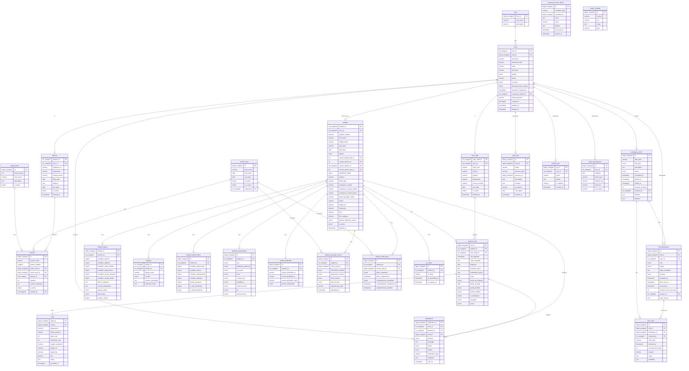

# 4Seasons Database ERD

```mermaid
erDiagram

    roles {
        tinyint_unsigned role_id PK
        varchar role_name
        varchar description
    }

    users {
        int_unsigned user_id PK
        tinyint_unsigned role_id FK
        varchar username
        varchar password_hash
        varchar email
        varchar full_name
        enum gender
        varchar phone
        tinyint is_active
        tinyint password_must_change
        timestamp password_changed_at
        int_unsigned created_by_admin_id FK
        varchar temp_password
        timestamp created_at
        timestamp updated_at
        timestamp deleted_at
    }

    students {
        int_unsigned student_id PK
        int_unsigned user_id FK
        varchar student_number
        varchar first_name
        varchar middle_name
        varchar last_name
        date birth_date
        enum gender
        int current_grade_level_id FK
        int current_section_id FK
        int_unsigned current_adviser_id FK
        int current_school_year_id FK
        enum enrollment_status
        varchar address
        varchar blood_type
        varchar emergency_contact
        varchar emergency_contact_relation
        varchar emergency_contact_phone
        varchar parent_guardian_name
        varchar phone
        decimal height_cm
        decimal weight_kg
        decimal bmi
        varchar bmi_category
        enum general_clearance_status
        tinyint is_active
        timestamp deleted_at
    }

    advisers {
        int_unsigned adviser_id PK
        int_unsigned user_id FK
        varchar employee_id
        varchar department
        varchar contact_phone
        date birth_date
        text address
        date hire_date
        tinyint is_active
        timestamp deleted_at
    }

    clinic_staff {
        int_unsigned clinic_staff_id PK
        int_unsigned user_id FK
        varchar staff_code
        varchar staff_id
        varchar position
        varchar department
        varchar license_number
        date hire_date
        tinyint is_active
        timestamp deleted_at
    }

    grade_levels {
        bigint_unsigned id PK
        int level_number
        varchar level_name
        text description
        tinyint is_active
    }

    school_years {
        bigint_unsigned id PK
        varchar year_name
        date start_date
        date end_date
        tinyint is_active
        tinyint is_current
        int_unsigned created_by FK
    }

    sections {
        bigint_unsigned id PK
        varchar section_name
        smallint section_number
        bigint_unsigned grade_level_id FK
        bigint_unsigned school_year_id FK
        int_unsigned adviser_id FK
        int capacity
        int current_enrollment
        tinyint is_active
        int_unsigned created_by FK
    }

    medical_visits {
        bigint_unsigned visit_id PK
        int_unsigned student_id FK
        int_unsigned clinic_staff_id FK
        timestamp visit_datetime
        text chief_complaint
        text diagnosis
        text treatment_given
        text medications_given
        text notes
        tinyint follow_up_required
        date follow_up_date
        tinyint parent_notified
        tinyint adviser_notified
        tinyint is_emergency
        enum visit_type
        enum status
    }

    vitals {
        bigint_unsigned vitals_id PK
        bigint_unsigned visit_id FK
        decimal temperature
        varchar blood_pressure
        int pulse_rate
        int respiratory_rate
        decimal oxygen_saturation
        decimal height_cm
        decimal weight_kg
        decimal bmi
        text notes
        timestamp recorded_at
    }

    medical_history {
        bigint_unsigned history_id PK
        int_unsigned student_id FK
        tinyint condition_asthma
        tinyint condition_diabetes
        tinyint condition_heart_problem
        tinyint condition_hypertension
        tinyint condition_seizure_disorder
        tinyint condition_mental_health
        text other_conditions
        text current_medications
        enum allergy_status
        enum pwd_status
        tinyint surgery_history
    }

    allergies {
        int_unsigned allergy_id PK
        int_unsigned student_id FK
        varchar allergy_name
        enum severity
        text reaction_description
        text treatment_notes
    }

    student_family_history {
        bigint_unsigned id PK
        int_unsigned student_id FK
        tinyint condition_tuberculosis
        tinyint condition_cancer
        tinyint condition_hypertension
        tinyint condition_diabetes
        tinyint smoke_exposure
        tinyint is_4ps_beneficiary
        tinyint is_sbfp_beneficiary
    }

    student_immunizations {
        bigint_unsigned id PK
        int_unsigned student_id FK
        enum bcg
        enum diphtheria_pertussis
        enum oral_polio
        enum mmr
        enum chicken_pox
        enum hepatitis_b
        enum tetanus_toxoid
        enum flu
        enum pneumococcal
    }

    student_philhealth {
        bigint_unsigned id PK
        int_unsigned student_id FK
        varchar learner_philhealth_id
        varchar parent_philhealth_id
        varchar parent_philhealth_name
        enum parent_relationship
    }

    student_parental_consent {
        bigint_unsigned id PK
        int_unsigned student_id FK
        bigint_unsigned school_year_id FK
        tinyint information_certified
        enum deworming_consent
        enum mrtd_consent
        enum wifa_consent
        varchar signature_file_path
        timestamp submitted_at
    }

    student_shdf_status {
        bigint_unsigned id PK
        int_unsigned student_id FK
        bigint_unsigned school_year_id FK
        tinyint basic_completed
        timestamp basic_completed_at
        tinyint comprehensive_completed
        timestamp comprehensive_completed_at
        timestamp comprehensive_deadline
    }

    qr_codes {
        bigint_unsigned id PK
        int_unsigned student_id FK
        varchar qr_token
        timestamp qr_generated_at
        timestamp qr_expires_at
    }

    emergency_drills {
        bigint_unsigned id PK
        varchar drill_name
        enum drill_type
        text description
        enum status
        timestamp scheduled_at
        timestamp started_at
        timestamp ended_at
        int duration_seconds
        int_unsigned created_by FK
        json settings
        json statistics
    }

    drill_participants {
        bigint_unsigned id PK
        bigint_unsigned drill_id FK
        int_unsigned user_id FK
        enum role
        enum status
        text injury_simulation
        enum severity
        timestamp assigned_at
        timestamp first_scan_at
        timestamp rescued_at
        int response_time_seconds
        int_unsigned rescuer_id FK
        json scan_history
    }

    drill_scans {
        bigint_unsigned id PK
        bigint_unsigned drill_id FK
        bigint_unsigned participant_id FK
        int_unsigned scanned_by FK
        varchar scan_type
        timestamp scanned_at
        int seconds_from_start
        varchar location
        text notes
        json metadata
    }

    notifications {
        bigint_unsigned notification_id PK
        int_unsigned user_id FK
        int_unsigned student_id FK
        bigint_unsigned visit_id FK
        enum channel
        text message
        enum status
        enum priority
        varchar notification_type
        json metadata
        timestamp sent_at
    }

    audit_logs {
        bigint_unsigned id PK
        bigint_unsigned user_id FK
        varchar action
        varchar resource_type
        bigint_unsigned resource_id
        text description
        json changes
        varchar ip_address
        text user_agent
        timestamp created_at
    }

    activity_logs {
        bigint_unsigned log_id PK
        int_unsigned user_id FK
        varchar action
        text details
        varchar ip_address
        timestamp created_at
    }

    push_subscriptions {
        bigint_unsigned id PK
        int_unsigned user_id FK
        text endpoint
        varchar token_type
        varchar p256dh_key
        varchar auth_key
        varchar user_agent
    }

    personal_access_tokens {
        bigint_unsigned id PK
        varchar tokenable_type
        bigint_unsigned tokenable_id
        text name
        varchar token
        text abilities
        timestamp last_used_at
        timestamp expires_at
    }

    system_settings {
        bigint_unsigned id PK
        varchar section
        varchar key
        text value
        varchar type
    }

    %% Relationships

    roles ||--o{ users : "has"
    users ||--o| advisers : "is"
    users ||--o| clinic_staff : "is"
    users ||--o| students : "has account"
    users ||--o{ activity_logs : "generates"
    users ||--o{ audit_logs : "generates"
    users ||--o{ push_subscriptions : "subscribes"
    users ||--o{ drill_participants : "participates"
    users ||--o{ notifications : "receives"
    users ||--o{ emergency_drills : "creates"

    grade_levels ||--o{ sections : "has"
    school_years ||--o{ sections : "has"
    school_years ||--o{ student_parental_consent : "scoped to"
    school_years ||--o{ student_shdf_status : "scoped to"

    advisers ||--o{ sections : "advises"

    students ||--o{ medical_visits : "has"
    students ||--o| medical_history : "has"
    students ||--o{ allergies : "has"
    students ||--o| student_family_history : "has"
    students ||--o| student_immunizations : "has"
    students ||--o| student_philhealth : "has"
    students ||--o{ student_parental_consent : "has"
    students ||--o{ student_shdf_status : "has"
    students ||--o{ qr_codes : "has"
    students ||--o{ notifications : "linked to"

    clinic_staff ||--o{ medical_visits : "handles"

    medical_visits ||--o| vitals : "has"
    medical_visits ||--o{ notifications : "triggers"

    emergency_drills ||--o{ drill_participants : "has"
    emergency_drills ||--o{ drill_scans : "has"
    drill_participants ||--o{ drill_scans : "scanned in"
```
